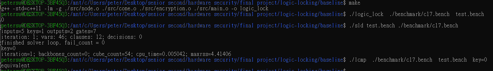

## How to use this function
1. Run `make` to generate the `logic_lock` executable.
2. Run "./logic_lock  ./benchmark/c17.bench  test.bench" to generate the encrypted circuit 
3. Run "./sld test.bench ./benchmark/c17.bench" to pose the sat attack 
4. Run "./lcmp  ./benchmark/c17.bench  test.bench  key=???" to lunch the equivariance checking

## How to use the bash 
1. put the `run_benchmark.sh` in baseline 
2. In the workstation, please make sure that the format is in linux form.
3. `bash run_benchmark.sh`

## template from 
This template is from https://github.com/Ohpaipai/Homework/tree/main